<p align="center">
  
</p>

<h1 align="center">Novometro</h1>

<p align="center">
  <strong>Collect the Tube with your friends.</strong><br />
  Check in at stations, unlock them on your map, complete lines, post the photo.
</p>

<p align="center">
  <a href="docs/screenshots/feed.png">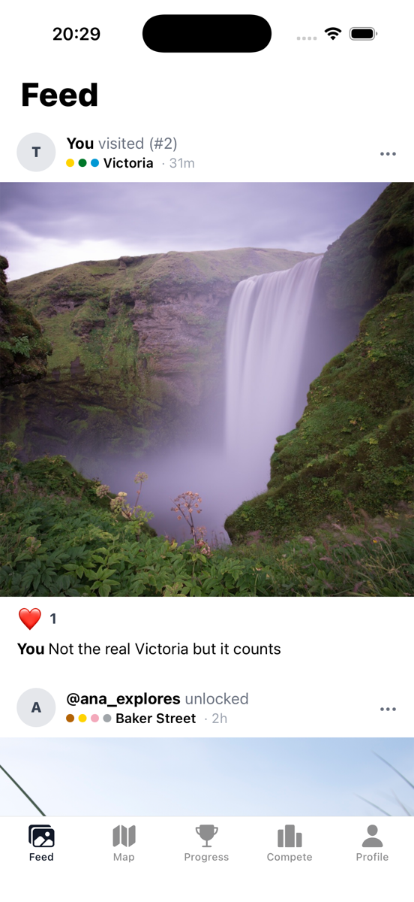</a>
  <a href="docs/screenshots/map.png">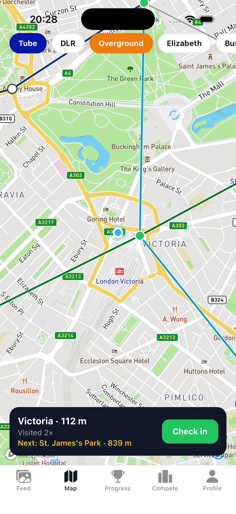</a>
  <a href="docs/screenshots/checkin.png">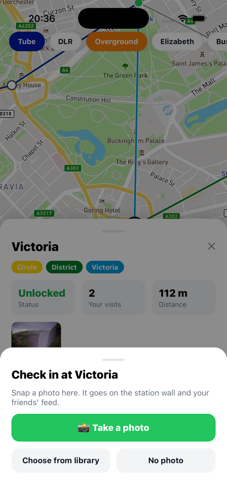</a>
  <a href="docs/screenshots/progress.png">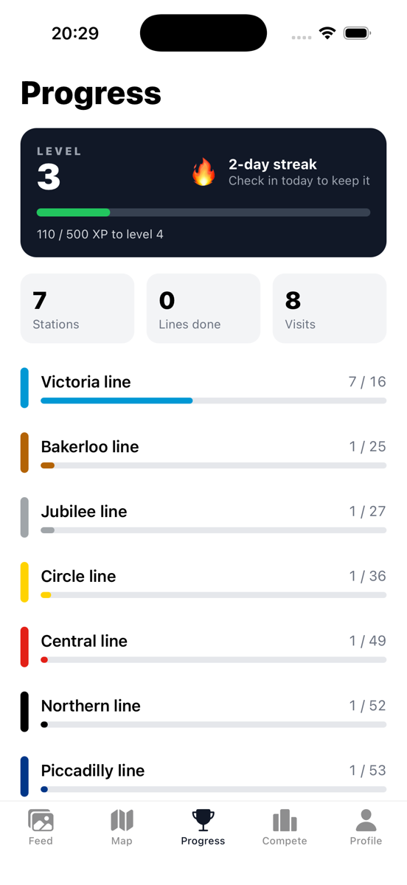</a>
</p>
<p align="center">
  <a href="docs/screenshots/line.png">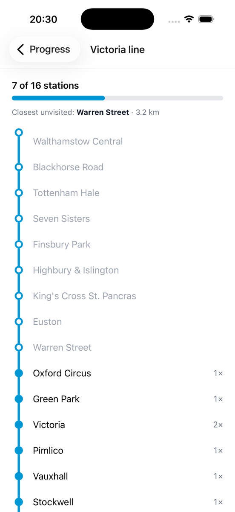</a>
  <a href="docs/screenshots/station.png">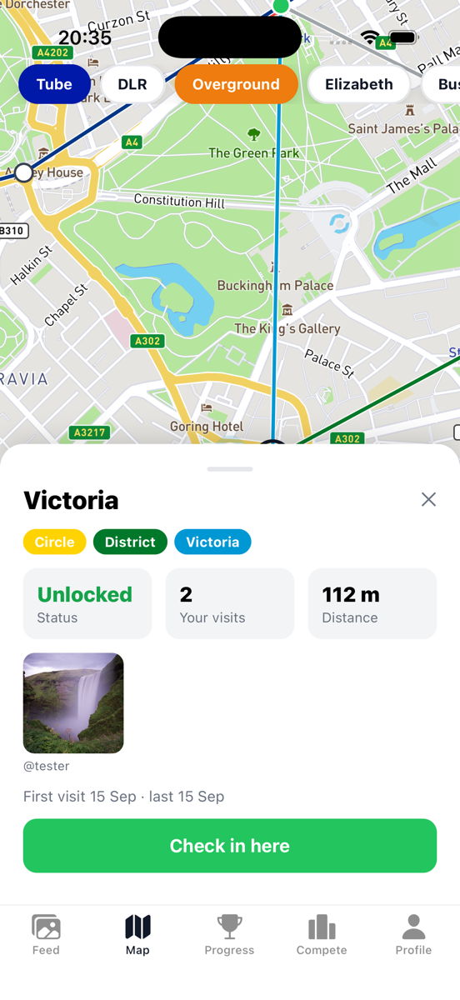</a>
  <a href="docs/screenshots/compete.png">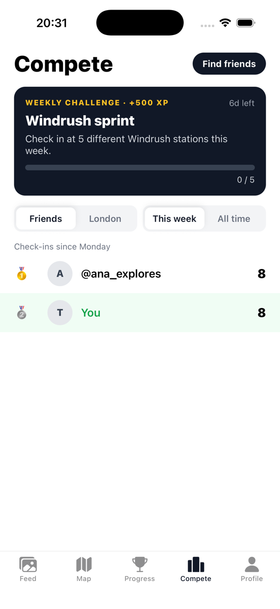</a>
  <a href="docs/screenshots/profile.png">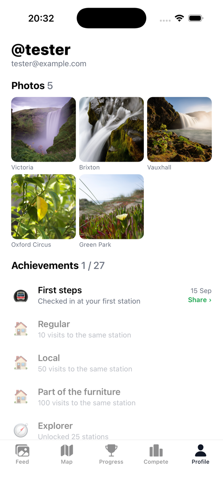</a>
</p>

## What it is

Novometro is a location-based social game built on a city's transit network. London is the first city: every Tube, DLR, Overground and Elizabeth line station is a node. Stand at one, check in, and it lights up on your map for good. Visit every station on a line and you complete it. Add a photo to a check-in and it lands on the station's wall and your friends' feed.

The whole thing is verified server-side. A check-in is only accepted if the phone's reported position is within 150 m of the station, the GPS accuracy is sane, the location isn't a mock provider, you haven't checked in there in the last 30 minutes, and the implied travel speed since your last check-in is plausible. The client never writes a visit directly.

## Features

**Core loop**
- Map of the whole network in line colours, with Tube / DLR / Overground / Elizabeth / Bus filters. Unlocked stations turn green.
- One-tap check-in with an optional photo and caption. Photo check-ins earn extra XP.
- Per-line progress with an ordered station rail, and a nudge toward the closest station you haven't unlocked.

**Social**
- Feed of your friends' check-ins: photo, station, line colours, visit number. Likes, reports, and a way to take your own photo down.
- Station walls: everyone's photos taken at that station.
- Follow people by username. Friends and London leaderboards, weekly and all-time.
- A weekly challenge that rotates automatically every Monday.

**Progression**
- Streaks, XP and levels computed on the server.
- Achievements: first visit, station regular (10 / 50 / 100 visits), explorer (25 / 100 / every station), every line, and one per line completion. Each earned one has a shareable card.
- Completing a line opens a full-screen celebration in the line's colour with your photos from that line on the card, and the share button right there.
- Confetti on first unlocks, and a daily streak reminder you're asked about after your first check-in, never at launch.

**Anti-cheat, layer one**
- Radius, accuracy, rate-limit and speed checks in the database. Mock-location rejection on Android. Three reports auto-hide a photo. A shadow-ban flag drops a user from leaderboards without telling them.

## Stack

| Layer | Choice |
| --- | --- |
| App | Expo SDK 53, React Native, expo-router, TanStack Query |
| Map | Mapbox (`@rnmapbox/maps`) with GPU line and circle layers |
| Backend | Supabase: Postgres + PostGIS, Row Level Security, RPC functions, Storage, pg_cron |
| Auth | Email one-time code; Apple and Google sign-in when configured |
| Data | TfL Unified API (lines, stations, ordered stop sequences, bus routes) |

Every rule lives in SQL under [`city-explorer/supabase/migrations`](city-explorer/supabase/migrations), covered by pgTAP tests in [`city-explorer/supabase/tests`](city-explorer/supabase/tests). The app is a thin client over a handful of RPCs: `check_in`, `feed`, `station_wall`, `leaderboard`, `my_stats`, `my_challenges`, `search_profiles`.

## Screens

| | |
| --- | --- |
| **Feed** | Friends' and your own check-ins, newest first. Like, report, remove your own. |
| **Map** | The network, filter chips, your position, the nearest station and its distance. Tap a station for its sheet and wall. |
| **Progress** | Level, XP, streak, then every line with a completion bar. Tap a line for the station rail. |
| **Compete** | This week's challenge, friends / London leaderboard, find friends. |
| **Profile** | Your photo grid, achievements with share cards, sign out. |

<p align="center">
  <a href="docs/screenshots/celebrate.png">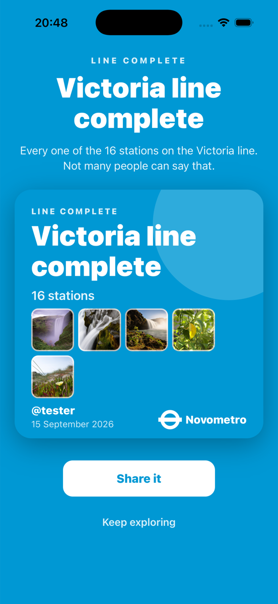</a>
  <a href="docs/screenshots/share.png">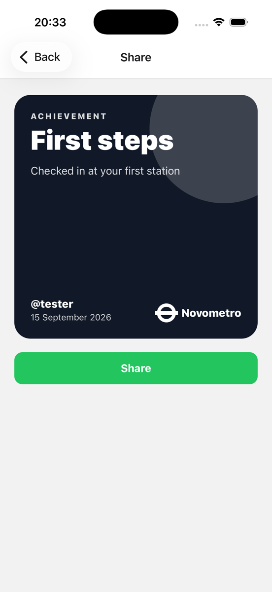</a>
  <a href="docs/screenshots/signin.png">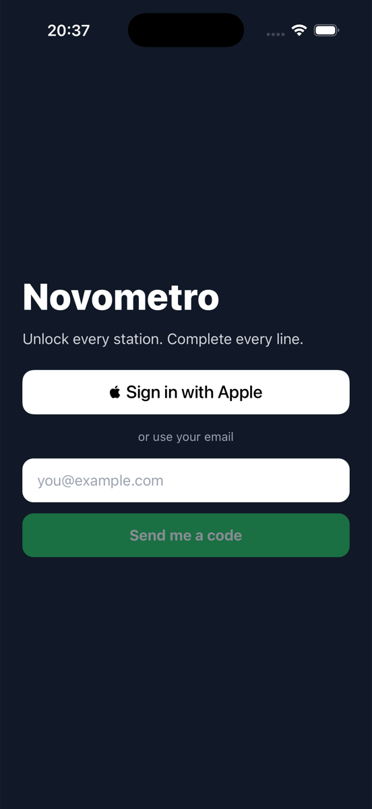</a>
</p>

## Run it locally

Prerequisites: Node 22+, Docker Desktop, Xcode (iOS) or Android Studio, a [Mapbox](https://account.mapbox.com) account, a [TfL API key](https://api-portal.tfl.gov.uk) (optional, raises rate limits).

```bash
git clone https://github.com/Zezoo123/Novometro.git
cd Novometro/city-explorer
npm install
cp .env.example .env
cp scripts/.env.example scripts/.env
```

Start the local Supabase stack (first run pulls Docker images):

```bash
npm run db:start
```

Fill `.env` and `scripts/.env` from the values `npx supabase status` prints. The app uses the anon key; the import scripts use the service role key. Add your Mapbox public token to `.env`, and put the Mapbox **secret** download token in `~/.gradle/gradle.properties` and `~/.netrc` (see [Environment](#environment)).

Load London:

```bash
npm run db:reset        # migrations + seed
npm run import:tfl      # 469 rail stations, 19 lines
npm run import:tfl:bus  # optional: 675 bus routes, 12.5k stops (a few minutes)
```

Run the app. Mapbox needs a development build; Expo Go will not work.

```bash
npm run ios
```

Sign in with any email: on the local stack the code lands in Mailpit at http://127.0.0.1:54324.

## Scripts

| Script | What it does |
| --- | --- |
| `db:start` / `db:stop` | Local Supabase in Docker |
| `db:reset` | Recreate the local database from migrations and seed |
| `db:test` | Run the pgTAP suites (60 tests) |
| `db:types` | Regenerate `src/lib/database.types.ts` from the local schema |
| `db:push:hosted` | Apply pending migrations to the hosted project via the Management API |
| `import:tfl` | Import London rail lines, stations and station ordering |
| `import:tfl:bus` | Import London bus routes and stops |

## Environment

`.env` holds only values that are safe to ship in the app binary (`EXPO_PUBLIC_*`). `scripts/.env` holds server-side keys and is never read by the app. Both are gitignored; the `.example` files are the reference.

The Mapbox **secret** download token never goes in the repo or in `.env`:

```
# ~/.gradle/gradle.properties
MAPBOX_DOWNLOADS_TOKEN=sk....

# ~/.netrc  (chmod 600)
machine api.mapbox.com
  login mapbox
  password sk....
```

Sign in with Apple needs the capability on the App ID in your Apple developer account. Google needs `EXPO_PUBLIC_GOOGLE_IOS_CLIENT_ID`. Both buttons stay hidden until configured.

## How a check-in works

1. The app watches your position and shows the nearest station within the current filter. The button enables inside 150 m plus your GPS accuracy (capped at 100 m).
2. On tap you take or pick a photo (optional). The photo is resized to 1440 px on the phone and uploaded to Storage under your own folder.
3. The app calls `check_in(station, lat, lon, accuracy, mocked, photo_path, caption)`.
4. Postgres verifies distance with PostGIS, accuracy, mock flag, the 30-minute per-station rate limit, and travel speed since your last visit. Then it writes the visit, evaluates achievements, and returns what you earned.
5. If the server rejects it, the app deletes the uploaded photo.

## Project layout

```
city-explorer/
  app/                 expo-router screens: welcome, sign-in, onboarding, (tabs), line/, share/, friends
  src/api/             typed calls to Supabase (stations, visits, checkin, photos, social, progress, ...)
  src/components/      CheckInBar, CheckInSheet, StationSheet, ModeFilter, ShareCard, Confetti
  src/hooks/           useCheckIn, useLocation, useRefetchOnFocus
  src/lib/             supabase client, generated types, map data, filters, reminders
  scripts/             TfL importers, hosted migration helper
  supabase/migrations  the schema, in order
  supabase/tests       pgTAP
docs/screenshots/
```

## Roadmap

Tracked in [issues](https://github.com/Zezoo123/Novometro/issues). Next up: an Android build for testers, device attestation (App Attest / Play Integrity), then store listing.

## Data and credits

Station, line and route data from [Transport for London](https://tfl.gov.uk/info-for/open-data-users/) under the TfL open data licence. Line colours are TfL's. Map tiles by Mapbox. Not affiliated with TfL.
